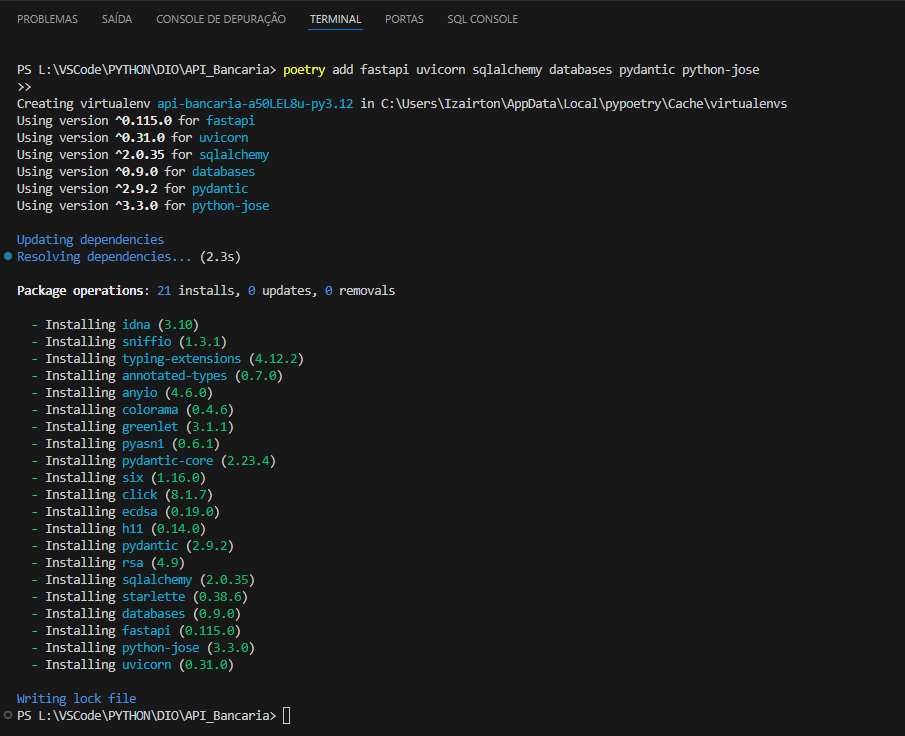
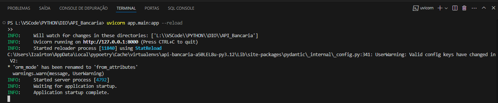

# API Bancária

Esta é uma API bancária desenvolvida com FastAPI e SQLAlchemy para gerenciar contas e transações em um banco de dados SQLite. O objetivo principal é fornecer uma interface para a criação de contas, realização de transações e consulta de dados relacionados.

## Tecnologias Utilizadas

- **FastAPI**: Framework para construção de APIs.
- **Uvicorn**: Servidor ASGI para executar aplicações FastAPI.
- **SQLAlchemy**: ORM para interagir com o banco de dados.
- **Databases**: Biblioteca para interações assíncronas com bancos de dados.
- **Pydantic**: Para validação de dados.
- **Python-Jose**: Para manipulação de JSON Web Tokens (JWT).
- **SQLite**: Banco de dados relacional.

## Estrutura do Projeto

API_Bancaria/
│
├── app/
│   ├── controllers/
│   │   ├── account.py
│   │   └── transaction.py
│   ├── models/
│   │   ├── account.py
│   │   └── transaction.py
│   ├── schemas/
│   │   ├── account.py
│   │   └── transaction.py
│   ├── services/
│   │   ├── account.py
│   │   └── transaction.py
│   ├── database.py
│   ├── main.py
│   └── create_db.py
│
├── .env
├── requirements.txt
└── create_tables.sql

## Configuração

1. Clone o repositório:
    git clone <https://github.com/IOVASCON/API_Conta_Bancaria.git>
    cd API_Bancaria

2. Instale as dependências:
    poetry install

3. Crie o banco de dados:

    Execute o seguinte comando para criar o banco de dados e as tabelas:
    python create_db.py

## Configuração do Ambiente

O arquivo .env deve conter as seguintes variáveis:
DATABASE_URL=sqlite:///./test.db
SECRET_KEY=seu_segredo_aqui

## Executando a API

Para iniciar o servidor da API, use:
uvicorn app.main:app --reload

A API estará disponível em <http://127.0.0.1:8000>.

## Endpoints

Conta

    Criar conta
        POST /accounts
        Corpo: {"account_number": "string", "balance": number}

    Listar contas
        GET /accounts?limit=10&skip=0

    Transações de uma conta
        GET /accounts/{id}/transactions?limit=10&skip=0

Transação

    Criar transação
        POST /transactions
        Corpo: {"account_id": number, "amount": number, "transaction_type": "string"}

## Contribuição

Se você deseja contribuir para este projeto, sinta-se à vontade para enviar um pull request ou abrir uma issue.
Licença

Este projeto está licenciado sob a MIT License - consulte o arquivo LICENSE para obter mais detalhes.

## Licença

Este projeto está licenciado sob a MIT License - consulte o arquivo LICENSE para obter mais detalhes.

## Imagens do Desenvolvimento do Projeto

## 1. Adicionando Dependências

## 2. Ambiente Virtual com Poetry

## 3. Chave Secreta

## 4. Criando Base de Dados

## 5. Criando pyproject.toml

## 6. Dependências Instaladas

## 7. FastAPI Navegador

## 8. Instalação do aioSQLite

## 9. Instalação do Databases

## 10. Instalação do Versão Poetry

## 11. Instalação do Pydantic Settings

## 12. Instalação do SQLAlchemy

## 13. Instalação do SQLite

## 14. Servidor Uvicorn Rodando

## 15. Versão do Pip

## 16. Versões do Python e Pip

